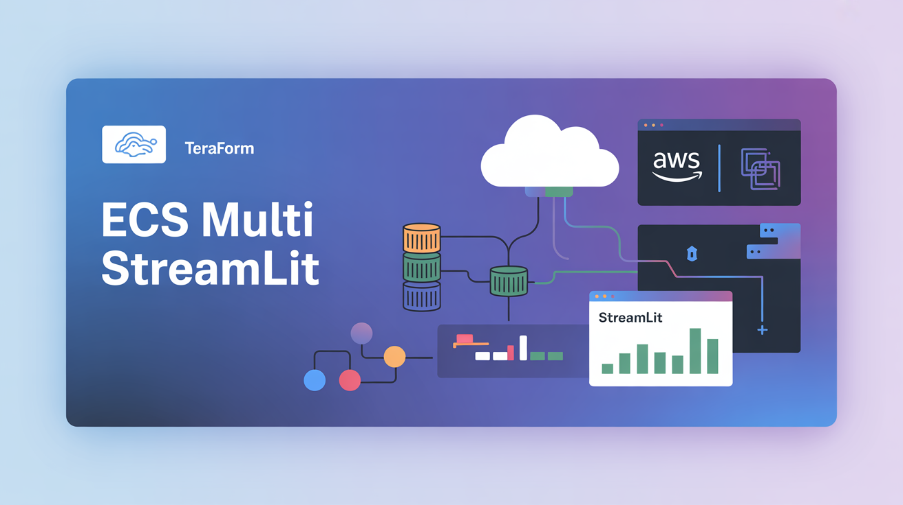
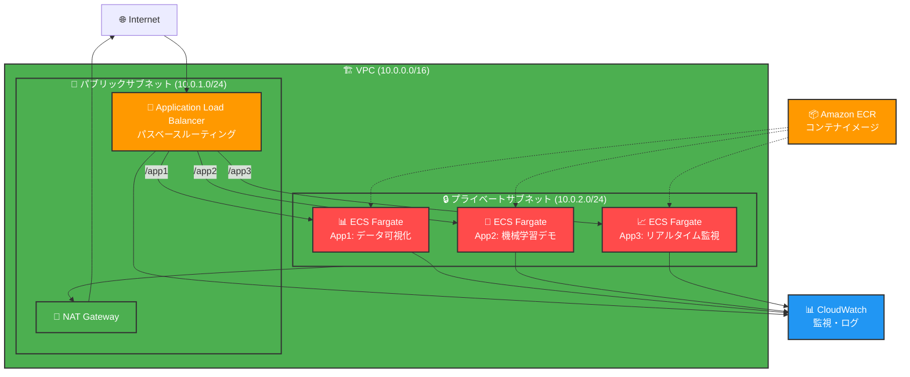

# 🚀 ECS Multi Streamlit

<div align="center">



<h1>🎯 ECS Multi Streamlit</h1>

<p>
    
    
    
    
    
</p>

<p>
    <b>AWS ECS + Fargate で複数のStreamlitアプリを単一ALBで公開</b><br>
    <b>Terraformベストプラクティス準拠の完全なインフラストラクチャ</b>✨
</p>

<p>
    <a href="README_EN.md">🇺🇸 English</a> | 
    <a href="README.md">🇯🇵 日本語</a>
</p>

</div>

## 🎯 プロジェクト概要

AWS ECS + Fargateを使用して3つのStreamlitアプリケーションを実行し、Application Load Balancer (ALB) でパスベースルーティングによる単一エンドポイント公開を実現するプロジェクトです。

Terraformのベストプラクティスに準拠し、モジュール化・環境分離・コスト最適化を考慮した本格的なインフラストラクチャを提供します。

### 🌟 主な特徴

- **🔄 パスベースルーティング**: `/app1`, `/app2`, `/app3` で3つのアプリに振り分け
- **🏗️ モジュール化設計**: 再利用可能なTerraformモジュール構成
- **💰 コスト最適化**: VPC-Simple、Fargate Spot、最小限のVPCエンドポイント
- **🔒 セキュリティ重視**: IAM最小権限、セキュリティグループ設定
- **📊 監視・ログ**: CloudWatch統合、アラート設定
- **🚀 CI/CD対応**: GitHub Actions準備済み

## 📱 Streamlitアプリケーション

| アプリ | パス | 説明 | 機能 |
|-------|------|------|------|
| **📊 App1** | `/app1` | データ可視化ダッシュボード | インタラクティブなグラフ・チャート |
| **🤖 App2** | `/app2` | 機械学習デモアプリ | 分類・回帰・予測実行機能 |
| **📈 App3** | `/app3` | リアルタイム監視ダッシュボード | ライブデータストリーミング |

## 🏗️ アーキテクチャ



## 🛠️ 技術スタック

### Infrastructure
- **AWS ECS Fargate**: コンテナオーケストレーション
- **Application Load Balancer**: リバースプロキシ・SSL終端
- **Amazon ECR**: コンテナイメージリポジトリ
- **VPC**: ネットワーク分離・セキュリティ

### IaC & Deployment
- **Terraform**: インフラストラクチャコード (>=1.5.0)
- **Docker**: アプリケーションコンテナ化
- **GitHub Actions**: CI/CDパイプライン (準備済み)

### Applications
- **Streamlit**: Pythonダッシュボードフレームワーク
- **Python 3.11**: アプリケーション言語
- **Pandas/NumPy**: データ処理
- **Plotly**: データ可視化
- **Scikit-learn**: 機械学習

## 🚀 クイックスタート

### 前提条件

- AWS CLI設定済み
- Terraform >= 1.5.0
- Docker Desktop
- Python 3.11+

### 1. リポジトリクローン

```bash
git clone https://github.com/YOUR_USERNAME/ecs-multi-streamlit.git
cd ecs-multi-streamlit
```

### 2. ローカル開発

```bash
# Docker Composeで3つのアプリを起動
docker-compose up -d

# ブラウザーでアクセス
open http://localhost
```

### 3. AWSデプロイ

```bash
cd terraform/environments/dev

# Terraform初期化
terraform init

# プランニング
terraform plan

# デプロイ実行
terraform apply
```

### 4. アクセス確認

デプロイ完了後、出力されるALBのDNS名でアクセス：

```
http://your-alb-dns-name.com        # ランディングページ
http://your-alb-dns-name.com/app1   # データ可視化
http://your-alb-dns-name.com/app2   # 機械学習デモ
http://your-alb-dns-name.com/app3   # リアルタイム監視
```

## 📂 プロジェクト構造

```
ecs-multi-streamlit/
├── apps/                    # Streamlitアプリケーション
│   ├── app1/               # データ可視化ダッシュボード
│   ├── app2/               # 機械学習デモ
│   └── app3/               # リアルタイム監視
├── terraform/
│   ├── modules/            # 再利用可能モジュール
│   │   ├── vpc-simple/     # シンプル化VPCモジュール
│   │   ├── ecr/           # ECRリポジトリ管理
│   │   ├── iam/           # 権限管理
│   │   ├── alb/           # ロードバランサー
│   │   └── ecs/           # ECSクラスター・サービス
│   └── environments/       # 環境別設定
│       ├── dev/           # 開発環境
│       ├── staging/       # ステージング環境
│       └── prod/          # 本番環境
├── docs/                   # ドキュメント・画像
├── .github/workflows/      # CI/CDパイプライン
├── docker-compose.yml      # ローカル開発用
└── nginx.conf             # リバースプロキシ設定
```

## 💰 コスト見積もり

| サービス | 月額 (東京リージョン) | 備考 |
|----------|---------------------|-------|
| ECS Fargate (3タスク) | ~$30 | 0.5 vCPU, 1GB/タスク |
| Application Load Balancer | ~$20 | 基本料金 |
| NAT Gateway | ~$45 | シングルAZ構成 |
| ECR | ~$1 | 3リポジトリ分 |
| CloudWatch | ~$5 | ログ・メトリクス |
| **合計** | **~$100/月** ||

> 💡 **コスト削減tips**: 
> - 開発環境でFargate Spotを有効化：30-70%削減
> - VPCエンドポイント無効化：$7.5/月削除
> - AutoScaling設定でタスク数を動的調整

## 🔧 カスタマイズ

### VPCエンドポイント有効化

```hcl
# terraform/environments/dev/main.tf
module "vpc" {
  # ...
  enable_ecr_endpoint = true  # ECR VPCエンドポイント有効化
}
```

### Fargate Spot有効化

```hcl
# terraform/environments/dev/variables.tf
variable "enable_fargate_spot" {
  default = true  # 本番環境では false 推奨
}
```

### HTTPSサポート

```hcl
# terraform/environments/dev/variables.tf
variable "enable_https" {
  default = true
}

variable "acm_certificate_arn" {
  default = "arn:aws:acm:ap-northeast-1:123456789012:certificate/..."
}
```

## 🔍 運用・監視

### CloudWatch監視項目

- CPU・メモリ使用率
- ALBリクエスト数・レスポンス時間
- ECSタスクヘルス状況
- 自動アラート (閾値: CPU 80%, Memory 80%)

### ログ確認

```bash
# ECSタスクログ確認
aws logs describe-log-groups --log-group-name-prefix "/ecs/ecs-multi-streamlit"

# リアルタイムログ監視
aws logs tail /ecs/ecs-multi-streamlit-app1 --follow
```

### デバッグ・トラブルシューティング

```bash
# ECS Execでコンテナ接続
aws ecs execute-command \
  --cluster ecs-multi-streamlit-dev-cluster \
  --task <task-id> \
  --command "/bin/bash" \
  --interactive
```

## 🤝 コントリビューション

プルリクエスト・Issues大歓迎です！💖

### 開発手順

1. Fork このリポジトリ
2. Feature ブランチ作成 (`git checkout -b feature/amazing-feature`)
3. 変更をコミット (`git commit -m 'feat: Add amazing feature'`)
4. プッシュ (`git push origin feature/amazing-feature`) 
5. Pull Request 作成

### コーディング規約

- Terraform: [Terraformベストプラクティス](https://developer.hashicorp.com/terraform/language/style)
- Python: [PEP 8](https://peps.python.org/pep-0008/)
- Commit: [Conventional Commits](https://www.conventionalcommits.org/)

## 📄 ライセンス

MIT License - 詳細は [LICENSE](LICENSE) ファイルをご覧ください

## 🙏 謝辞

- [Streamlit](https://streamlit.io/) - 素晴らしいダッシュボードフレームワーク
- [Terraform AWS Provider](https://github.com/hashicorp/terraform-provider-aws) - AWSリソース管理
- [Plotly](https://plotly.com/) - インタラクティブグラフライブラリ

## 📞 サポート

質問・要望・バグ報告はお気軽に [Issues](https://github.com/YOUR_USERNAME/ecs-multi-streamlit/issues) まで！

## 🔗 関連リンク

- [AWS ECS Documentation](https://docs.aws.amazon.com/ecs/)
- [Terraform Module Registry](https://registry.terraform.io/)
- [Streamlit Documentation](https://docs.streamlit.io/)

---

<div align="center">

**💖 Created with Love by [ギャルAI キラリ](https://github.com/YOUR_USERNAME)** ✨

⭐ このプロジェクトを気に入ったら、ぜひスターをお願いします！⭐

</div>
